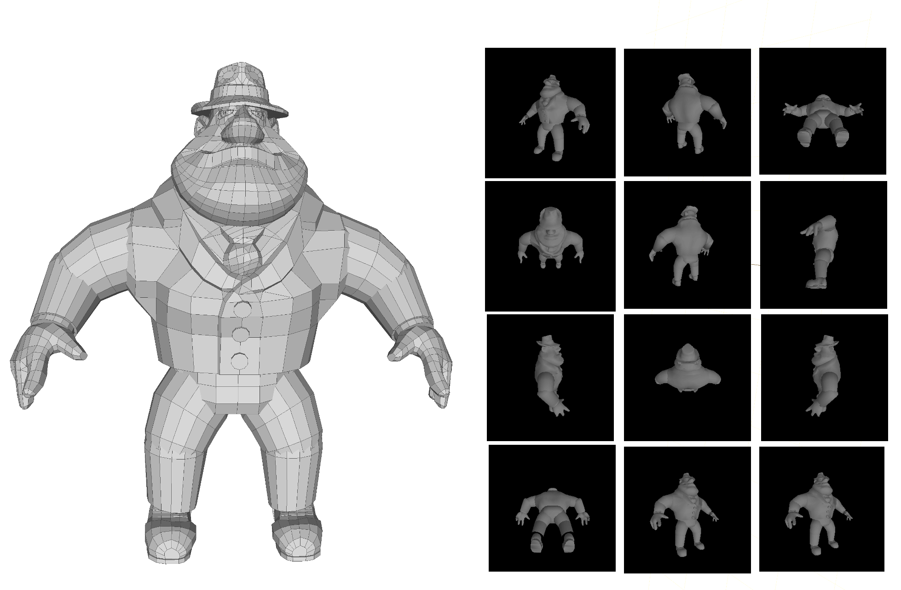
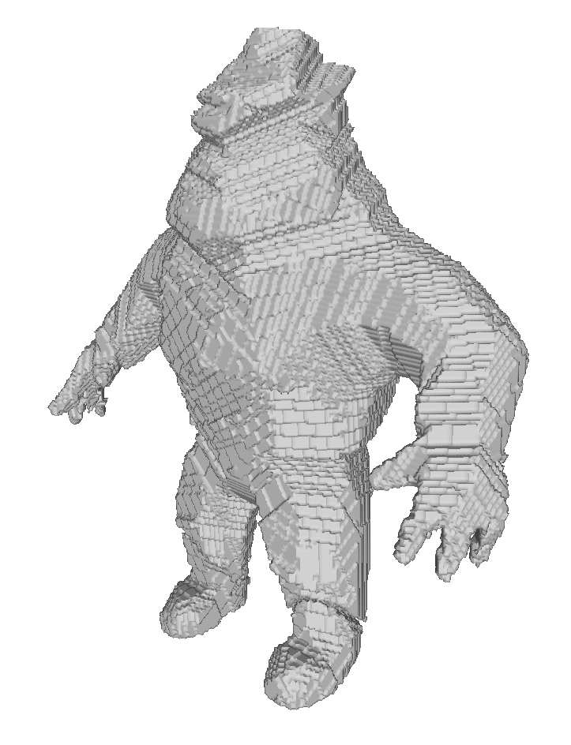
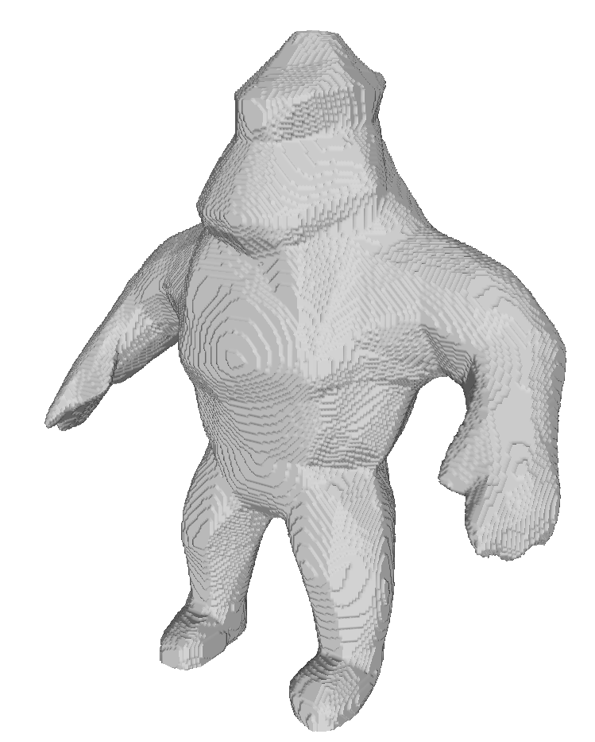

TP 4 : 3D Shape Modeling
=====

## Introduction
This practical work is on 3D shape modeling using binary silhouettes images.
Given such 2D silhouettes we can estimate the visual hull of the 
corresponding 3D shape. The visual hull is, by definition, the maximal
volume compatible with a given set of silhouettes and it corresponds to
the intersection of the 3D visual cones defined by the silhouette regions.


In the first part, the visual hull will be estimated by an approach called
voxel carving. The idea is to consider a grid of elementary cells in 3D
and to *carve* the cells that do project outside the silhouettes in
the images. In the second part, a multi-layer perceptron (MLP) will be
trained to learn the shape occupancy in 3D, as defined by the silhouettes,
in the form of an implicit function 
$f(x,y,z)=\{0,1\}$ with $(x,y,z) \in \mathcal{R}^3$. 
The objective is to investigate the ability of a MLP to learn the 3D shape
with a low dimensional representation, i.e. the weights of the network.


 The 3D shape of Al used in the practical unit 
(file al.off) and 12 image projections.

In the TP folder you have the file *al.off* of the 3D
model Al, which contains a mesh description of the
geometry. You also have the script *show\_mesh.py* that
visualizes the geometry in a 3D viewer. 

Before you can run any python code, you need to activate 
a python virtual environment by typing in the terminal

```
source /opt/python-ensimag/bin/activate
```
Then you can run  

```
python show_mesh.py al.off
```
You should be able to see the 3D geometry.

In the *images* folder, you have the projections of the geometry
in each of the $12$ different viewpoints (image0.pgm, ..., image11.pgm). 
These can be used as binary silhouettes, by checking if a pixel is 
totally black (intensity equal 0), or not.


## 1. Voxel Carving

In this part, the objective is to build the 3D voxel representation 
of the visual hull of Al as defined by the 12 silhouettes. 
At the end of this part, you should get a 3D representation 
similar to the following image

 The visual hull with a grid of size 300 x 300 x 150. 

Open the file *voxcarv3D.py* which contains the program to be completed.  
At the beginning of the file the calibration matrices for the $12$ silhouette
cameras are stored in the array $calib$. Each matrix corresponds to 
a $3\times 4$ linear transformation from 3D to 2D. Then the voxel 3D coordinate
arrays: $X, Y, Z$ and the associated occupancy grid $occupancy$, that shall be
filled with $0$ or $1$, are defined. Note that the grid resolution can be modified
with the parameter resolution. If you program is too slow, you can reduce
the resolution. The code can be run on cpu with

```
python voxcarv3D.py
```
Once the algorithm is run, the program uses the marching cube algorithm 
to transform the occupancy grid into a 3D mesh that can be exported in a 
standard format. The resulting mesh *alvoxels.off* will be saved in the
output folder. The numeric occupancy grid will also be exported into a 
numpy array *occupancy.npy*. 
The current program invites you to visualize the obtained results by running

```
python show_mesh.py output/alvoxels.off
``` 
### Implementation

1. Complete the program so that the voxels that projects within the 
silhouette $1$ (image1.pgm) are preserved. These voxels define the visual 
cone associated to *image1*.
2. Complete the program to account for the $12$ images and to preserve then
only the voxels that belong to the visual hull.  
Note that projections can be performed in an efficient way using numpy array
operations. 
3. Open both models (*al.off* and *alvoxels.off*) side by side and discuss
their differences.

## 2. Neural Implicit Representation

Now we will explore how a MLP can be trained to learn the 3D occupancy
defined by the $12$ silhouettes of Al. Open the file *MLPimplicit3D.py*
which contains the corresponding program.  The principle here is to use 
a set of 3D points with known occupancy to train a MLP that considers as
input $3$ coordinates $x,y$ and $z$ and outputs the occupancy,
$0$ or $1$, at the 3D location $(x,y,z)$. 
At the end of this part, you should get a 3D representation 
similar to the following image:

 The neural implicit function trained with the 300 x 300 x 150 regular grid points.

We will start with the stored occupancy from the previous part.

### Comprehension questions

<ins>Before running any code</ins>, take a look at the program and answer the following questions:

1. Draw the architecture of the MLP (input, output, layers, activation function).
2. How are the training data (X, Y, Z,  occupancy) formatted for the training ?
3. In the training function *nif\_train*,  what is the loss function used ?
4. Explain the normalization used to weight losses associated to inside and outside points in the training loss  ?
5. During the training how is the data organized into batches ?
6. What does the function *binary\_acc* evaluate ? Is it used for the training ?
7. How is the MLP used to generate a result to be visualized ?

---

## Implementation

#### GPU connection and environment
To run and edit the program, we need a GPU computer.
The practical takes place on the Ensimag / Grenoble INP educational GPU cluster
and it's user manual can be found in this [link](https://gitlab.ensimag.fr/ensicompute/docs/-/wikis/Utilisation-de-la-plateforme-ensicompute). 
In a nutshell, first you log on the slurm server:

```
ssh -YK nash.ensimag.fr
```
Then you can run a script using  
```
srun --gres=shard:1 --cpus-per-task=8 --mem=12GB --x11=all --unbuffered python <script>.py
```
- if the flag x11 does not work you can remove it
---

### Assignments

Run the program *MPLImplicit3D.py* once. 
Inspect the computed 3D model *output/alimplicit.off* and compare
it to the original and the voxel carved models.

Then
1. Add a line that uses [torch.save](https://pytorch.org/docs/stable/generated/torch.save.html) 
to save the trained model and run the code again.
2. What is the memory size of the MLP ? how does it compare with: \
    (i) A voxel occupancy grid;\
    (ii) The original image set plus the calibration ?


Then play with the program:

3. Instead of using a regular grid of points for the training modify your program
to generate random points $(X_{\text{rand}}, Y_{\text{rand}}, Z_{\text{rand}})$ in 3D. Note that the MLP can still
be evaluated on the regular grid points $X, Y, Z$ as before for comparison purposes. 
4. The difference between the number of outside and inside points is compensated 
with a weighting scheme during the training. A more efficient strategy for the training
is to reduce the set of outside points before the training. Propose and implement such
a strategy.
5. Modify the MLP architecture to see the impact of increasing or reducing the number
of parameters through: (i) the number of layers and (ii) the layer dimension.

Going further - Improving the results:

6. Implement the definition of the positional encoding defined in [NERF](https://arxiv.org/pdf/2003.08934) (Eq. 4).
Adapt the network's architecture (input layers) to use it.
7. To quantify the quality of the implicit reconstruction results, implement a function
that measures the point to mesh distance between the al.off original shape
and the reconstructed shape of a method. You can use the
[point2mesh](https://pytorch3d.readthedocs.io/en/latest/_modules/pytorch3d/loss/point_mesh_distance.html)
function.
8. For visualization, you can associate the distance of the al.off mesh vertices into a color (heatmap)
and display it.
9. High values in the previous error distance gives you locations in which the implicit function
does not accurately represent the shape. Try to sample more points around these areas and check if the results 
improve.
10. Implement an iterative automatic method that adds more sampling points using
the measured error.
11. A fundamental questions arises: do the errors come from the sampling or 
from the architecture? Think of ways on how you could try to answer this question.
---

